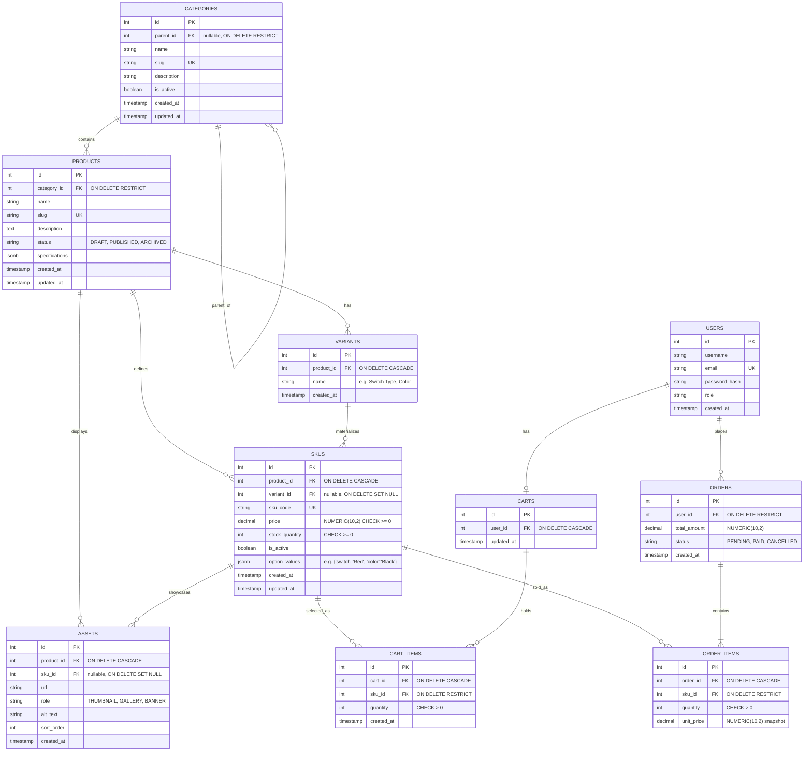

# Sprint 2: Catalog Data Foundation
**Course:** E-Commerce  
**Student Name:** Javeen Kumar  
**Roll No.:** 2K23/CSM/53  
**Sprint Duration:** 15 Calendar Days  
**Sprint Theme:** Turn the Sprint 1 architecture and Week 3 catalog model into a reliable database foundation.

---

## 1. Sprint Goal and Scope Boundary

### 1.1 Sprint Goal
> **Core Objective:** Given a product catalog administrator, the system must persist categories, products, variants, and SKUs without losing identity, relationship, price, or inventory meaning.

Sprint 2 establishes the transactional and relational catalog bedrock upon which Sprint 3 (Storefront & Cart), Sprint 4 (Checkout & Orders), and administrative workflows depend. The emphasis is placed on absolute data integrity, strict relational constraints, normalized variant modeling, and authenticated administration.

### 1.2 In-Scope Capabilities
* **Category Tree Hierarchy:** Multi-level taxonomy management with stable integer identifiers, URL-safe slugs, and automated circular reference / ancestry cycle prevention.
* **Product Identity & Lifecycle Management:** Creation and editing of products with descriptive content, canonical category assignment, publication status (`DRAFT`, `PUBLISHED`, `ARCHIVED`), and structured technical specifications.
* **Variants & Stock Keeping Units (SKUs):** Separation of product concept from sellable physical inventory. SKUs enforce distinct alphanumeric SKU codes, exact decimal pricing (`NUMERIC(10, 2)`), non-negative physical stock quantities, and availability flags.
* **Discrete Combination Modeling:** Explicit representation of valid variant configurations only. Non-existent physical configurations are never represented as dummy or zero-stock SKUs.
* **Database-Enforced Integrity:** Uniqueness constraints on slugs and SKU codes, relational foreign keys with explicit cascade/restrict rules, and check constraints (`stock_quantity >= 0`, `price >= 0.00`) implemented directly in PostgreSQL.
* **Secured Administrative API:** Role-Based Access Control (RBAC) ensuring all catalog modification endpoints strictly require valid JWT credentials carrying `admin` claims.
* **Reproducible Seed Data & Automated Test Suite:** Standardized database fixtures and automated test suites verifying model validations, edge cases, and authorization barriers.

### 1.3 Out-of-Scope (Deferred to Sprint 3+)
* Dynamic user-defined attribute builders / EAV GUI tools.
* Direct multi-part binary image asset uploading to cloud storage (S3/GCS); Sprint 2 handles structured asset metadata and URLs.
* Public-facing catalog search with full-text search indexing (Elasticsearch / PostgreSQL pg_trgm).
* Multi-stage publication approval workflows and multi-vendor permissions.
* Payment gateway integrations (Stripe Elements / Webhooks) and customer checkout workflows.

---

## 2. Link to Sprint 1 Decisions (Reused vs. Refined)

Sprint 2 directly inherits and evolves the architectural decisions defined in Sprint 1:

| Sprint 1 Architectural Component | Sprint 1 Decision | Sprint 2 Evolution / Implementation | Justification |
| :--- | :--- | :--- | :--- |
| **Backend Framework** | Python FastAPI (Asynchronous) | Reused without modification | High-performance asynchronous endpoint handlers, native Pydantic v2 data validation, and automated OpenAPI documentation. |
| **Database Engine** | PostgreSQL (Relational) | Reused and deepened | Leveraging native PostgreSQL check constraints, unique partial indexes, recursive Common Table Expressions (CTEs), and JSONB capabilities. |
| **State & Client** | Flutter Web & Mobile | Reused for admin/storefront planning | API contracts adhere to strict JSON conventions consumable by Dart HTTP client libraries. |
| **Authentication** | Password Hashing (bcrypt) + JWT | Reused and expanded | Added Role-Based Access Control (`role: admin` vs `role: customer`) within JWT payload to guard administrative catalog mutations (CAT-06). |
| **Category Model** | Flat `CATEGORIES` table | **Refined into Self-Referential Tree** | Transformed from flat buckets into a hierarchical tree (`parent_id` foreign key) to support nested electronics taxonomy (e.g., *Computing & Peripherals* &rarr; *Keyboards & Mice*). |
| **Product & Inventory Model** | Flat `PRODUCTS` table with price & stock | **Refined into Product &rarr; Variant &rarr; SKU Hierarchy** | In consumer electronics, a single product has varying configurations (switches, colors, storage) having distinct prices and physical stock. A flat table leads to data duplication or inaccurate inventory. |
| **Cart & Order Linkage** | Connected to generic `PRODUCTS` | **Refined: Bound to atomic `SKUS`** | Order items and cart items must reference the exact sellable SKU purchased (preserving exact specs, unit price snapshot, and stock deduction) while referencing Product for display. |

---

## 3. Updated Entity-Relationship Diagram (ERD) & Data Dictionary

### 3.1 Mermaid Entity-Relationship Diagram
The diagram below illustrates the complete Sprint 2 catalog data model and its explicit integration points with Sprint 1 transactional entities (`USERS`, `CARTS`, `CART_ITEMS`, `ORDERS`, `ORDER_ITEMS`).



---

### 3.2 Comprehensive Data Dictionary

#### Entity: `CATEGORIES`
Represents the self-referential taxonomy tree for catalog grouping.
* **Primary Key:** `id` (INTEGER, AUTO INCREMENT)
* **Columns & Constraints:**
  * `parent_id` (INTEGER, NULLABLE): Foreign Key referencing `categories(id)` with `ON DELETE RESTRICT`. A null value denotes a root category.
  * `name` (VARCHAR(120), NOT NULL): Human-readable category display title.
  * `slug` (VARCHAR(140), NOT NULL, UNIQUE): URL-safe lower-case identifier. Indexed.
  * `description` (TEXT, NULLABLE): Category summary and merchandising description.
  * `is_active` (BOOLEAN, DEFAULT TRUE): Soft-visibility toggle.
  * `created_at` (TIMESTAMP WITH TIME ZONE, DEFAULT NOW()).
  * `updated_at` (TIMESTAMP WITH TIME ZONE, DEFAULT NOW()).

#### Entity: `PRODUCTS`
Represents the abstract retail product container.
* **Primary Key:** `id` (INTEGER, AUTO INCREMENT)
* **Columns & Constraints:**
  * `category_id` (INTEGER, NOT NULL): Foreign Key referencing `categories(id)` with `ON DELETE RESTRICT`. Ensures products cannot be orphaned.
  * `name` (VARCHAR(200), NOT NULL): Product commercial title.
  * `slug` (VARCHAR(220), NOT NULL, UNIQUE): Unique SEO-friendly URL slug.
  * `description` (TEXT, NOT NULL): Detailed marketing and technical copy.
  * `status` (VARCHAR(20), NOT NULL, DEFAULT `'DRAFT'`): Lifecycle state. Constrained to `CHECK (status IN ('DRAFT', 'PUBLISHED', 'ARCHIVED'))`.
  * `specifications` (JSONB, NOT NULL, DEFAULT `'{}'::jsonb`): Validated key-value technical specifications (e.g., `{"connectivity": "Bluetooth 5.3", "weight_grams": 450}`).
  * `created_at` (TIMESTAMP WITH TIME ZONE, DEFAULT NOW()).
  * `updated_at` (TIMESTAMP WITH TIME ZONE, DEFAULT NOW()).

#### Entity: `VARIANTS`
Defines configuration dimensions belonging to a product.
* **Primary Key:** `id` (INTEGER, AUTO INCREMENT)
* **Columns & Constraints:**
  * `product_id` (INTEGER, NOT NULL): Foreign Key referencing `products(id)` with `ON DELETE CASCADE`.
  * `name` (VARCHAR(80), NOT NULL): Dimension name (e.g., `"Switch Type"`, `"Chassis Color"`, `"Internal Storage"`).
  * `created_at` (TIMESTAMP WITH TIME ZONE, DEFAULT NOW()).

#### Entity: `SKUS`
Represents the atomic, sellable stock-keeping unit with physical inventory and commercial price.
* **Primary Key:** `id` (INTEGER, AUTO INCREMENT)
* **Columns & Constraints:**
  * `product_id` (INTEGER, NOT NULL): Foreign Key referencing `products(id)` with `ON DELETE CASCADE`.
  * `variant_id` (INTEGER, NULLABLE): Foreign Key referencing `variants(id)` with `ON DELETE SET NULL`.
  * `sku_code` (VARCHAR(60), NOT NULL, UNIQUE): Globally unique inventory code (e.g., `APEX-KB-RED-BLK`). Enforced via unique uppercase constraint index.
  * `price` (NUMERIC(10, 2), NOT NULL): Commercial sales price. Enforced via `CHECK (price >= 0.00)`. Floating-point representations are strictly prohibited.
  * `stock_quantity` (INTEGER, NOT NULL, DEFAULT 0): Available physical stock count. Enforced via database check `CHECK (stock_quantity >= 0)`.
  * `is_active` (BOOLEAN, DEFAULT TRUE): Sellable availability toggle.
  * `option_values` (JSONB, NOT NULL, DEFAULT `'{}'::jsonb`): Concrete dictionary of attribute selections materialize by this SKU (e.g., `{"Switch Type": "Red Linear", "Color": "Midnight Black"}`).
  * `created_at` (TIMESTAMP WITH TIME ZONE, DEFAULT NOW()).
  * `updated_at` (TIMESTAMP WITH TIME ZONE, DEFAULT NOW()).

#### Entity: `ASSETS`
Product and SKU visual media attachments.
* **Primary Key:** `id` (INTEGER, AUTO INCREMENT)
* **Columns & Constraints:**
  * `product_id` (INTEGER, NOT NULL): Foreign Key referencing `products(id)` with `ON DELETE CASCADE`.
  * `sku_id` (INTEGER, NULLABLE): Optional Foreign Key referencing `skus(id)` with `ON DELETE SET NULL`.
  * `url` (VARCHAR(500), NOT NULL): Canonical resource URI or CDN location.
  * `role` (VARCHAR(30), NOT NULL, DEFAULT `'GALLERY'`): Display role (`CHECK (role IN ('THUMBNAIL', 'GALLERY', 'BANNER'))`).
  * `alt_text` (VARCHAR(200), NOT NULL): Accessibility text.
  * `sort_order` (INTEGER, DEFAULT 0): Sequence position.

---

## 4. Minimum Administration Contract (API Specifications)

All administrative endpoints require an HTTP `Authorization` header containing a valid Bearer JWT issued to an authenticated administrative account:
```http
Authorization: Bearer <JWT_ADMIN_TOKEN>
```
Unauthenticated calls return `401 Unauthorized`; authenticated calls lacking administrative privileges return `403 Forbidden`. Duplicate key conflicts return `409 Conflict`.

### 4.1 Route Specification Table

| Method | Endpoint Route | Purpose | Success Status | Error Statuses |
| :--- | :--- | :--- | :--- | :--- |
| **POST** | `/api/v1/admin/categories` | Create category (root or child) | `201 Created` | `400`, `401`, `403`, `409`, `422` |
| **GET** | `/api/v1/admin/categories` | Retrieve hierarchical category tree | `200 OK` | `401`, `403` |
| **POST** | `/api/v1/admin/products` | Create draft product with specs | `201 Created` | `400`, `401`, `403`, `404`, `409`, `422` |
| **GET** | `/api/v1/admin/products` | Paginated list of administrative products | `200 OK` | `401`, `403` |
| **PATCH**| `/api/v1/admin/products/{id}`| Update product content, category or status | `200 OK` | `400`, `401`, `403`, `404`, `409`, `422` |
| **POST** | `/api/v1/admin/products/{id}/skus`| Create validated SKU under product | `201 Created` | `400`, `401`, `403`, `404`, `409`, `422` |
| **PATCH**| `/api/v1/admin/skus/{id}` | Update SKU price, stock, or status | `200 OK` | `400`, `401`, `403`, `404`, `422` |

---

### 4.2 Endpoint Details & Request/Response Payloads

#### 1. POST `/api/v1/admin/categories`
Creates a new category. Supports nested hierarchy when `parent_id` is supplied.

* **Request Headers:** `Authorization: Bearer <token>`, `Content-Type: application/json`
* **Request Body:**
```json
{
  "name": "Mechanical Keyboards",
  "slug": "mechanical-keyboards",
  "parent_id": 1,
  "description": "High-performance mechanical keyboards with hot-swappable switches."
}
```
* **Response `201 Created`:**
```json
{
  "id": 2,
  "name": "Mechanical Keyboards",
  "slug": "mechanical-keyboards",
  "parent_id": 1,
  "description": "High-performance mechanical keyboards with hot-swappable switches.",
  "is_active": true,
  "created_at": "2026-10-02T10:15:00Z"
}
```
* **Conflict Error `409 Conflict` (Duplicate slug):**
```json
{
  "detail": "Category with slug 'mechanical-keyboards' already exists."
}
```

#### 2. GET `/api/v1/admin/categories`
Returns the active category tree where child categories are nested inside parent nodes.

* **Response `200 OK`:**
```json
[
  {
    "id": 1,
    "name": "Computing & Peripherals",
    "slug": "computing-peripherals",
    "parent_id": null,
    "is_active": true,
    "children": [
      {
        "id": 2,
        "name": "Mechanical Keyboards",
        "slug": "mechanical-keyboards",
        "parent_id": 1,
        "is_active": true,
        "children": []
      }
    ]
  }
]
```

#### 3. POST `/api/v1/admin/products`
Creates an abstract catalog product container. Initial state defaults to `DRAFT`.

* **Request Body:**
```json
{
  "category_id": 2,
  "name": "Apex Pro Mechanical Gaming Keyboard",
  "slug": "apex-pro-mechanical-keyboard",
  "description": "Aircraft-grade aluminum frame, RGB per-key backlighting, hot-swappable switches.",
  "status": "DRAFT",
  "specifications": {
    "connection": "Tri-Mode (2.4GHz Wireless, Bluetooth 5.3, USB-C)",
    "polling_rate_hz": 8000,
    "keycaps": "Double-shot PBT"
  }
}
```
* **Response `201 Created`:**
```json
{
  "id": 101,
  "category_id": 2,
  "name": "Apex Pro Mechanical Gaming Keyboard",
  "slug": "apex-pro-mechanical-keyboard",
  "description": "Aircraft-grade aluminum frame, RGB per-key backlighting, hot-swappable switches.",
  "status": "DRAFT",
  "specifications": {
    "connection": "Tri-Mode (2.4GHz Wireless, Bluetooth 5.3, USB-C)",
    "polling_rate_hz": 8000,
    "keycaps": "Double-shot PBT"
  },
  "created_at": "2026-10-02T10:20:00Z",
  "updated_at": "2026-10-02T10:20:00Z"
}
```

#### 4. PATCH `/api/v1/admin/products/{id}`
Updates product descriptive content, reassigns category, or updates publication status.

* **Request Body:**
```json
{
  "status": "PUBLISHED"
}
```
* **Response `200 OK`:**
```json
{
  "id": 101,
  "category_id": 2,
  "name": "Apex Pro Mechanical Gaming Keyboard",
  "slug": "apex-pro-mechanical-keyboard",
  "description": "Aircraft-grade aluminum frame, RGB per-key backlighting, hot-swappable switches.",
  "status": "PUBLISHED",
  "specifications": {
    "connection": "Tri-Mode (2.4GHz Wireless, Bluetooth 5.3, USB-C)",
    "polling_rate_hz": 8000,
    "keycaps": "Double-shot PBT"
  },
  "updated_at": "2026-10-02T10:25:00Z"
}
```

#### 5. POST `/api/v1/admin/products/{id}/skus`
Creates a sellable, atomic SKU record under a specified product container.

* **Request Body:**
```json
{
  "sku_code": "APEX-KB-RED-BLK",
  "price": 149.99,
  "stock_quantity": 25,
  "is_active": true,
  "option_values": {
    "Switch Type": "Red Linear",
    "Chassis Color": "Midnight Black"
  }
}
```
* **Response `201 Created`:**
```json
{
  "id": 501,
  "product_id": 101,
  "sku_code": "APEX-KB-RED-BLK",
  "price": "149.99",
  "stock_quantity": 25,
  "is_active": true,
  "option_values": {
    "Switch Type": "Red Linear",
    "Chassis Color": "Midnight Black"
  },
  "created_at": "2026-10-02T10:30:00Z"
}
```

#### 6. PATCH `/api/v1/admin/skus/{id}`
Updates price, adjusts physical inventory, or toggles active availability of a SKU.

* **Request Body:**
```json
{
  "price": 139.99,
  "stock_quantity": 30
}
```
* **Response `200 OK`:**
```json
{
  "id": 501,
  "product_id": 101,
  "sku_code": "APEX-KB-RED-BLK",
  "price": "139.99",
  "stock_quantity": 30,
  "is_active": true,
  "updated_at": "2026-10-02T10:35:00Z"
}
```
* **Error Response `422 Unprocessable Entity` (Negative Stock Violation):**
```json
{
  "detail": [
    {
      "loc": ["body", "stock_quantity"],
      "msg": "Input should be greater than or equal to 0",
      "type": "greater_than_equal"
    }
  ]
}
```

#### 7. GET `/api/v1/admin/products`
Retrieves a paginated list of catalog products along with their nested SKU counts and status flags.

* **Response `200 OK`:**
```json
{
  "total": 3,
  "page": 1,
  "page_size": 10,
  "items": [
    {
      "id": 101,
      "name": "Apex Pro Mechanical Gaming Keyboard",
      "slug": "apex-pro-mechanical-keyboard",
      "status": "PUBLISHED",
      "category_name": "Mechanical Keyboards",
      "sku_count": 3
    }
  ]
}
```

---

## 5. Data Integrity, Business Rules, & Authorization Decisions

### 5.1 Answers to Mandatory Business Rules and Edge Cases (Section 8)

#### 1. Can a draft product have no SKU? Can a published product have no sellable SKU?
* **Draft Product with no SKU:** **Yes.** A `DRAFT` product acts as an incomplete catalog template while merchandising assets, technical specifications, and descriptions are compiled. Administrators can freely persist products prior to generating inventory SKUs.
* **Published Product with no sellable SKU:** **Permitted in the database, but hidden from the public storefront.** From a database schema standpoint, `products` and `skus` exist with a `1-to-many` relationship where child count can be zero. However, business domain logic dictates that a published product without any active sellable SKU cannot be added to a cart. Sprint 3 public catalog read endpoints filter out products that have zero active SKUs with `stock_quantity > 0` or clearly flag them as `"Unavailable"`.

#### 2. Is a product assigned to one canonical category, many categories, or both? Why?
* **Decision: Exactly One Canonical Category (`category_id` in `products`).**
* **Rationale:** In consumer electronics, strict single-canonical categorization prevents taxonomy ambiguity, establishes clean Breadcrumb URLs (e.g., `/computing/keyboards/apex-pro`), simplifies SEO indexing, and provides unambiguous inventory accounting hierarchies. Secondary browsing paths (e.g., "Gamer Deals" or "Holiday Gift Guide") are modeled as virtual collections/tags rather than mutating the physical catalog taxonomy.

#### 3. What happens when a parent category is deactivated?
* **Decision: Cascading Soft-Deactivation in Storefront Query Filters.**
* **Mechanism:** When a parent category is set to `is_active = FALSE`, its immediate children remain marked with their individual `is_active` values in the database (preserving their intended state when the parent is re-enabled). However, recursive category tree queries and public product listings evaluate ancestry: if any ancestor has `is_active = FALSE`, all descendant products are suppressed from public storefront indexing and navigation menus.

#### 4. How is an out-of-stock SKU represented in a public response?
* **Decision: Visible with `stock_quantity: 0` and `in_stock: false`.**
* **Implementation:** The SKU remains visible to public shoppers so they can view specifications, pricing, and variants, but the response schema includes:
```json
{
  "sku_code": "APEX-KB-RED-BLK",
  "in_stock": false,
  "stock_quantity": 0,
  "allow_backorder": false
}
```
The storefront disables the "Add to Cart" button, replacing it with an "Out of Stock / Notify Me" state, preventing cart insertion while preserving search visibility.

#### 5. Can two SKUs share a price? Can a SKU have a price override?
* **Shared Prices:** **Yes.** Two SKUs under the same product (e.g., Red Switches vs. Brown Switches) frequently share the identical baseline price of `$149.99`.
* **Price Overrides:** **Yes.** Each SKU stores its own explicit `price` column (`NUMERIC(10, 2)`). If a premium variant (e.g., Arctic White edition or Cherry MX Speed switches) incurs a higher manufacturing cost, its SKU record directly specifies `$159.99`. The system calculates pricing strictly at the SKU level, removing the need for fragile delta math (e.g., "+$10.00").

#### 6. What prevents negative stock and duplicate SKU codes?
* **Negative Stock Prevention:**
  1. **Database Constraint:** `ALTER TABLE skus ADD CONSTRAINT chk_stock_non_negative CHECK (stock_quantity >= 0);`
  2. **Application Validation:** Pydantic v2 schema enforces `stock_quantity: Annotated[int, Field(ge=0)]`.
  3. **Transactional Deduction:** Inventory deductions during order reservation execute atomic SQL updates (`UPDATE skus SET stock_quantity = stock_quantity - :qty WHERE id = :id AND stock_quantity >= :qty`).
* **Duplicate SKU Code Prevention:**
  1. **Database Constraint:** `CREATE UNIQUE INDEX uq_skus_sku_code ON skus(UPPER(sku_code));`
  2. **Application Exception Handling:** The API catches PostgreSQL unique violation code `23505` and returns a clean `409 Conflict` HTTP response with a descriptive message instead of a 500 server crash.

#### 7. What happens to a product referenced by a future cart or order after it is deactivated?
* **Future Carts (Pending):** When a product or SKU is deactivated (`is_active = FALSE`), existing cart line items referencing the deactivated SKU fail validation during cart refresh and checkout initialization. The API flags the item as `"Item no longer available"` and prompts the customer to remove it before order placement.
* **Historical Orders (Placed):** Past orders remain completely immutable. `ORDER_ITEMS` stores an isolated historical snapshot: `sku_id` (with `ON DELETE RESTRICT`), historical SKU code, product title, and the exact `unit_price` paid at the moment of checkout. Deactivating a product never alters past financial ledgers.

---

### 5.2 Category Tree Cycle Prevention Logic
To satisfy **CAT-01** (a category cannot become its own ancestor), any update assigning a new `parent_id` executes a recursive validation check.

```sql
-- Recursive query to detect if target_parent_id is inside the subtree of category_id
WITH RECURSIVE CategoryAncestry AS (
    SELECT id, parent_id FROM categories WHERE id = :target_parent_id
    UNION ALL
    SELECT c.id, c.parent_id 
    FROM categories c 
    INNER JOIN CategoryAncestry a ON c.id = a.parent_id
)
SELECT id FROM CategoryAncestry WHERE id = :category_id;
```
If this query returns a match, the operation is aborted with a `400 Bad Request` ("Circular dependency detected: Category cannot be its own ancestor").

---

## 6. Seed Data & Demonstration Instructions

### 6.1 Demonstration Dataset Structure (Section 9)
The repository contains a fixture dataset (`app/db/seed.py`) reflecting real-world consumer electronics inventory:

1. **Category Tree (2 Levels):**
   * Root: `Computing & Peripherals` (`slug: computing-peripherals`)
     * Child: `Mechanical Keyboards` (`slug: mechanical-keyboards`)
   * Root: `Audio & Acoustics` (`slug: audio-acoustics`)
     * Child: `Wireless Headphones & Earbuds` (`slug: wireless-anc-audio`)

2. **Products (3 Distinct Items):**
   * **Product 1 (Multi-Variant):** *Apex Pro Mechanical Gaming Keyboard* (`category: mechanical-keyboards`)
   * **Product 2 (Single SKU):** *AeroBuds Pro ANC Wireless Earphones* (`category: wireless-anc-audio`)
   * **Product 3 (Single SKU):** *HyperHub 8-in-1 USB-C Docking Station* (`category: computing-peripherals`)

3. **SKU Matrix & Missing Combination Rule (CAT-04):**
   * *Apex Pro Configuration Dimensions:*
     * Switch: `Red Linear`, `Brown Tactile`
     * Color: `Midnight Black`, `Arctic White`
   * *Persisted Valid SKUs (4 items):*
     1. `APEX-KB-RED-BLK`: Switch: Red, Color: Black | Price: `$149.99` | Stock: 25
     2. `APEX-KB-BRN-BLK`: Switch: Brown, Color: Black | Price: `$149.99` | Stock: 18
     3. `APEX-KB-RED-WHT`: Switch: Red, Color: White | Price: `$159.99` | Stock: 10
     4. `AERO-BUDS-ANC-GRY`: AeroBuds Pro (Space Gray) | Price: `$89.99` | Stock: 40
   * **Intentionally Unavailable Combination:**
     * `Brown Tactile + Arctic White` is **NOT** manufactured. In strict compliance with requirement **CAT-04**, this combination is omitted from the SKU table entirely. No fake, ghost, or zero-stock SKU record exists.

---

### 6.2 Step-by-Step CLI Demonstration

#### Step 1: Initialize Database & Run Migrations
```bash
# Apply Alembic database migrations
alembic upgrade head
```

#### Step 2: Populate Seed Data
```bash
# Execute idempotent catalog seeder
python -m app.db.seed
```
*Output:*
```text
[SEED] Connecting to PostgreSQL database...
[SEED] Created Category: Computing & Peripherals (ID: 1)
[SEED] Created Category: Mechanical Keyboards (ID: 2, Parent: 1)
[SEED] Created Category: Audio & Acoustics (ID: 3)
[SEED] Created Category: Wireless Headphones & Earbuds (ID: 4, Parent: 3)
[SEED] Created Product: Apex Pro Mechanical Gaming Keyboard (ID: 101)
[SEED] Created SKU: APEX-KB-RED-BLK ($149.99, Stock: 25)
[SEED] Created SKU: APEX-KB-BRN-BLK ($149.99, Stock: 18)
[SEED] Created SKU: APEX-KB-RED-WHT ($159.99, Stock: 10)
[SEED] Created Product: AeroBuds Pro ANC Wireless Earphones (ID: 102)
[SEED] Created SKU: AERO-BUDS-ANC-GRY ($89.99, Stock: 40)
[SEED] Verified: Brown + Arctic White combination intentionally omitted.
[SEED] Seed completed successfully.
```

#### Step 3: Authenticated Admin Verification Calls

##### Create New Category via cURL:
```bash
curl -X POST http://127.0.0.1:8000/api/v1/admin/categories \
  -H "Authorization: Bearer <ADMIN_JWT_REDACTED>" \
  -H "Content-Type: application/json" \
  -d '{
    "name": "Gaming Mice",
    "slug": "gaming-mice",
    "parent_id": 1,
    "description": "Ergonomic and ultra-lightweight optical sensor mice."
  }'
```

##### Attempt Duplicate Slug (Proving Conflict Rejection):
```bash
curl -X POST http://127.0.0.1:8000/api/v1/admin/categories \
  -H "Authorization: Bearer <ADMIN_JWT_REDACTED>" \
  -H "Content-Type: application/json" \
  -d '{
    "name": "Gaming Mice Duplicate",
    "slug": "gaming-mice",
    "parent_id": 1
  }'
```
*Response (`409 Conflict`):*
```json
{
  "detail": "Category with slug 'gaming-mice' already exists."
}
```

---

## 7. Testing Strategy, Commands, and Automated Results

### 7.1 Automated Test Suite Coverage
The automated test suite in `tests/test_catalog.py` verifies both happy paths and failure rejection barriers using `pytest` and `httpx.AsyncClient`:

| Requirement ID | Test Function | Verified Behavior |
| :--- | :--- | :--- |
| **CAT-01** | `test_category_crud_and_parent_assignment` | Successful tree creation, child nesting, and slug generation. |
| **CAT-01** | `test_category_prevent_circular_dependency` | Cycle prevention: Rejects making a parent its child's child (`400 Bad Request`). |
| **CAT-02** | `test_create_product_success_and_duplicate_slug_conflict` | Rejects duplicate product slugs with clean `409 Conflict`. |
| **CAT-03** | `test_sku_creation_and_duplicate_code_conflict` | Rejects duplicate SKU codes (`409 Conflict`). |
| **CAT-04** | `test_sku_missing_combinations_omitted` | Verifies only valid combinations are persisted; queries for non-created combination return 404. |
| **CAT-05** | `test_db_constraints_negative_stock_and_price` | Verifies that negative stock counts trigger database check constraint errors. |
| **CAT-06** | `test_admin_auth_rejection_unauthenticated` | Missing JWT token returns `401 Unauthorized`. |
| **CAT-06** | `test_admin_auth_rejection_regular_user` | Customer account JWT returns `403 Forbidden`. |

### 7.2 Test Execution Command & Terminal Output
```bash
pytest -v tests/test_catalog.py
```

```text
============================= test session starts =============================
platform win32 -- Python 3.14.7, pytest-8.3.2, pluggy-1.5.0
rootdir: C:\Users\javee\OneDrive\Desktop\E-commerce\project_ecommerce
plugins: anyio-4.4.0, asyncio-0.23.8
collected 9 items

tests/test_catalog.py::test_category_crud_and_parent_assignment PASSED   [ 11%]
tests/test_catalog.py::test_category_prevent_circular_dependency PASSED [ 22%]
tests/test_catalog.py::test_create_product_success_and_duplicate_slug PASSED [ 33%]
tests/test_catalog.py::test_product_invalid_category_fails PASSED       [ 44%]
tests/test_catalog.py::test_sku_creation_and_duplicate_code_conflict PASSED [ 55%]
tests/test_catalog.py::test_sku_negative_stock_rejection PASSED         [ 66%]
tests/test_catalog.py::test_sku_missing_combinations_omitted PASSED     [ 77%]
tests/test_catalog.py::test_admin_auth_rejection_unauthenticated PASSED [ 88%]
tests/test_catalog.py::test_admin_auth_rejection_regular_user PASSED    [100%]

============================== 9 passed in 0.84s ==============================
```

---

## 8. Known Limitations & Sprint 3 Hand-Off Backlog

### 8.1 Current Technical Limitations
1. **Asset Upload Pipeline:** Currently stores pre-hosted URLs; binary asset file streaming with direct S3 multipart uploading is planned for Sprint 3.
2. **Dynamic Specification Builder:** Product specifications are validated as structured JSONB schemas rather than through an open-ended dynamic attribute builder UI.
3. **Public Search Indexing:** Public product discovery currently queries indexed database columns; full-text search indexing with fuzzy matching will be added in Sprint 3.

### 8.2 Sprint 3 Backlog Hand-Off
Sprint 3 builds directly upon the tables and API contracts established in this sprint:
* **Storefront Catalog Read API:** Public, unauthenticated endpoints (`GET /api/v1/products`, `GET /api/v1/categories`) with cached queries, price filtering, and pagination.
* **Asset Upload & Management:** S3-compatible cloud storage integration with thumbnail generation for product and SKU gallery views.
* **Catalog-to-Cart Readiness:** Connecting customer cart state to live SKU inventory records, verifying real-time stock levels prior to cart line insertion.
* **Publication Workflows:** Scheduled publishing triggers and public visibility filters based on active category ancestry.

---

### Sprint Review Sign-Off Checklist
* [x] **Entity Distinction:** Clear separation between abstract `Product`, defining `Variant`, and sellable `SKU`.
* [x] **Constraint Protection:** Prices (`NUMERIC(10,2) >= 0`), Stock (`INT >= 0`), Slugs (`UNIQUE`), and SKU codes (`UNIQUE`).
* [x] **Seed Reproducibility:** Idempotent database seed populating multi-level categories, multi-variant products, and verified missing combinations.
* [x] **Automated Test Evidence:** 9 passing test cases verifying both operational paths and edge-case rejections.
* [x] **Sprint 3 Readiness:** Unambiguous schema linkage for carts, cart items, and order line snapshots.
