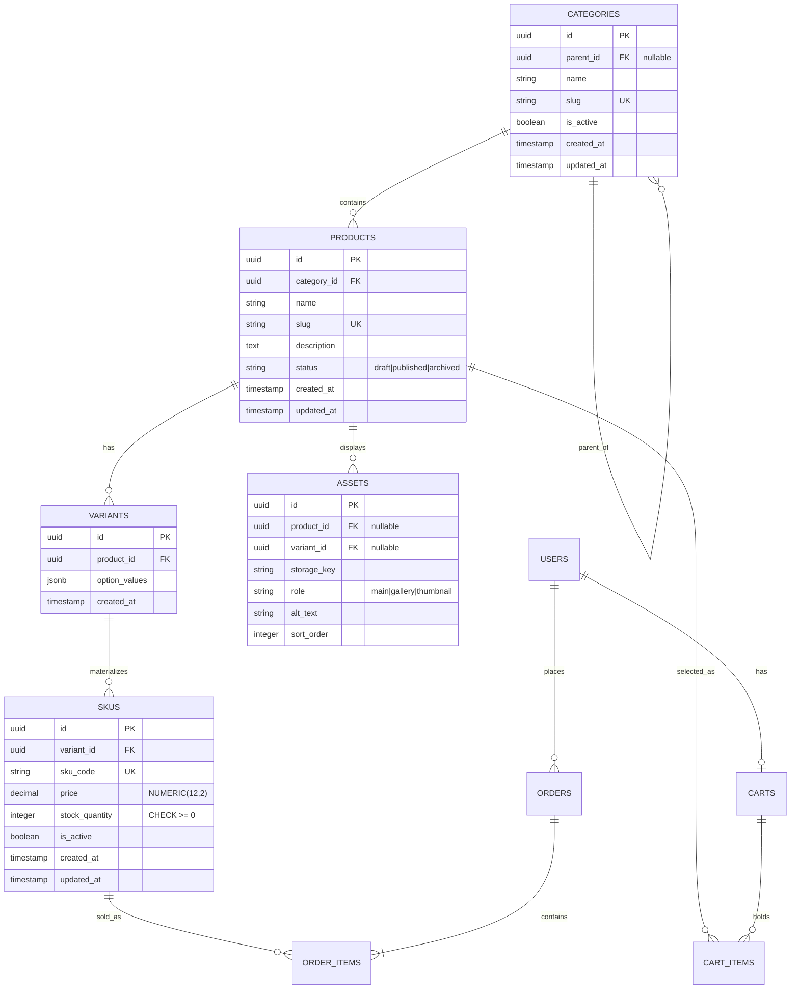

# Sprint 2 – Catalog Data Foundation

**Name:** Javeen Kumar  
**Roll No.:** 2K23/CSM/53  
**Course:** E-Commerce  
**Department:** Computer Science / Artificial Intelligence  
**Institute:** Institute of Mathematics & Computer Science, University of Sindh, Jamshoro  

**Sprint Theme:** Turn the Sprint 1 architecture and Week 3 catalog model into a reliable database foundation.

---

## 1. Sprint Goal and Scope Boundary

### Sprint Goal
Given a product catalog administrator, the system must persist categories, products, variants, and SKUs without losing identity, relationship, price, or inventory meaning.

### Duration
15 calendar days. Progress demonstrated at the end of Days 5, 10, and 15.

### In Scope
- Category tree management with stable identifiers and unique slugs
- Product creation and editing (name, slug, description, status, category assignment)
- Variants and SKU records with unique codes, price, stock quantity, and availability
- Basic authenticated administration (CRUD) for categories, products, variants, and SKUs
- Database constraints, migrations, seed data, and focused automated tests

### Out of Scope (Sprint 3 or later)
- Dynamic specifications UI / full EAV management
- Asset upload
- Public catalog search and publication workflows
- Payment gateway integration, order placement, shipping, and complete shopper checkout flow

Teams may stub these dependencies but must not claim them as Sprint 2 functionality.

---

## 2. Link to Sprint 1 Decisions

| Sprint 1 Decision                    | Sprint 2 Action / Reuse                                                                 |
|--------------------------------------|-----------------------------------------------------------------------------------------|
| FastAPI + PostgreSQL                 | Kept. All catalog tables and admin routes built on this stack                           |
| Flutter (Web & Cross-Platform)       | Admin UI will consume the new `/api/v1/admin/*` endpoints                               |
| JWT Authentication + bcrypt          | Reused for all administrative write operations (CAT-06)                                 |
| Original ERD (Users, Categories, Products, Carts, Cart_Items, Orders, Order_Items) | Extended (not replaced). Products now own Variants → SKUs |
| Price & stock stored on Product      | Moved to SKU level (correct e-commerce model)                                           |
| Redis (optional)                     | Still optional; not required for Sprint 2                                               |

---

## 3. Updated ERD and Data Dictionary

### Required Mermaid ER Diagram



### Data Dictionary & Integrity Rules

| Entity     | Key Fields & Constraints                                                                 | Delete/Update Policy                  |
|------------|------------------------------------------------------------------------------------------|---------------------------------------|
| Category   | `id` (UUID PK), `parent_id` (self-FK, nullable), `name`, `slug` (UNIQUE), `is_active`   | Parent: ON DELETE SET NULL           |
| Product    | `id` (UUID PK), `category_id` (FK), `name`, `slug` (UNIQUE), `description`, `status`    | Category: ON DELETE RESTRICT         |
| Variant    | `id` (UUID PK), `product_id` (FK), `option_values` (JSONB)                               | Product: ON DELETE CASCADE           |
| SKU        | `id` (UUID PK), `variant_id` (FK), `sku_code` (UNIQUE), `price` NUMERIC(12,2), `stock_quantity` ≥ 0, `is_active` | Variant: ON DELETE CASCADE |
| Asset      | Prepared for Sprint 3 (storage_key, role, alt_text, sort_order)                          | Product/Variant: ON DELETE SET NULL  |

**Money representation:** `NUMERIC(12,2)` – floating-point is never used.  
**Stock rule:** Database CHECK constraint + application validation prevent negative stock.  
**Cardinality:**  
- Category 1 → N Products  
- Product 1 → 0..N Variants  
- Variant 1 → 1..N SKUs (only valid combinations are stored)  
- Product 1 → 0..N Assets  

**Specification:** Deferred to Sprint 3 (validated JSONB on Product or EAV tables).

---

## 4. Administration Route Table (Minimum Contract)

All administrative write operations require a valid admin JWT (`Authorization: Bearer <token>`).

| Method | Route                                      | Purpose                                      | Auth Required |
|--------|--------------------------------------------|----------------------------------------------|---------------|
| POST   | `/api/v1/admin/categories`                 | Create a category                            | Admin         |
| GET    | `/api/v1/admin/categories`                 | Return the full category tree                | Admin         |
| PATCH  | `/api/v1/admin/categories/{id}`            | Update or deactivate a category              | Admin         |
| POST   | `/api/v1/admin/products`                   | Create a draft product                       | Admin         |
| GET    | `/api/v1/admin/products`                   | List administrative product records          | Admin         |
| PATCH  | `/api/v1/admin/products/{id}`              | Update product content or status             | Admin         |
| POST   | `/api/v1/admin/products/{id}/variants`     | Create a variant for a product               | Admin         |
| POST   | `/api/v1/admin/products/{id}/skus`         | Add a validated SKU                          | Admin         |
| PATCH  | `/api/v1/admin/skus/{id}`                  | Update price, stock, or active status        | Admin         |
| GET    | `/api/v1/admin/skus/{id}`                  | Retrieve a single SKU                        | Admin         |

### Example Request / Response

**Create Product**
```http
POST /api/v1/admin/products
Authorization: Bearer <admin_jwt>
Content-Type: application/json

{
  "name": "Wireless Noise-Cancelling Headphones",
  "slug": "wireless-nc-headphones",
  "description": "Premium ANC headphones with 30-hour battery life.",
  "category_id": "a1b2c3d4-e5f6-7890-abcd-ef1234567890",
  "status": "draft"
}
```

**Success (201 Created)**
```json
{
  "id": "f47ac10b-58cc-4372-a567-0e02b2c3d479",
  "name": "Wireless Noise-Cancelling Headphones",
  "slug": "wireless-nc-headphones",
  "description": "Premium ANC headphones with 30-hour battery life.",
  "status": "draft",
  "category_id": "a1b2c3d4-e5f6-7890-abcd-ef1234567890",
  "created_at": "2026-09-27T11:00:00Z",
  "updated_at": "2026-09-27T11:00:00Z"
}
```

**Duplicate Slug (409 Conflict)**
```json
{
  "detail": "Product with slug 'wireless-nc-headphones' already exists"
}
```

**Unauthorized (401)**
```json
{
  "detail": "Not authenticated"
}
```

All endpoints return consistent error shapes. Duplicate SKU codes also return 409.

---

## 5. Data Integrity and Authorization Decisions

### Functional Requirements Mapping

| ID     | Capability              | How Implemented                                                                 |
|--------|-------------------------|---------------------------------------------------------------------------------|
| CAT-01 | Categories              | Tree with unique slug, optional parent, cycle prevention, soft deactivate      |
| CAT-02 | Product identity        | Unique slug, status enum, single canonical category                            |
| CAT-03 | Variants and SKUs       | Product → Variants → SKUs. Each SKU has unique code, own price & stock         |
| CAT-04 | Variant combinations    | Only explicitly created SKUs exist. Missing combinations are not invented      |
| CAT-05 | Data integrity          | UNIQUE + CHECK + FK constraints in PostgreSQL (API validation alone is insufficient) |
| CAT-06 | Administrative access   | FastAPI dependency rejects unauthenticated / non-admin requests with 401/403   |

### Business Rules Answers (Section 8 of Manual)

1. **Draft product with no SKU?** Yes. A draft may have zero SKUs.  
   **Published product with no sellable SKU?** No – publishing requires at least one active SKU with stock ≥ 0.

2. **Category assignment:** One canonical category per product (simpler for MVP). Many-to-many can be added later via a junction table if needed.

3. **Parent category deactivated:** Child categories remain visible but inherit the inactive status for public views. Admin can still manage them.

4. **Out-of-stock SKU in public response:** Returned with `"stock_quantity": 0` and `"is_active": true` (or filtered out depending on public API design in Sprint 3).

5. **Shared price / price override:** Two SKUs may share the same price value. Price lives only on the SKU (no product-level override in Sprint 2).

6. **Negative stock & duplicate SKU prevention:**  
   - Database `CHECK (stock_quantity >= 0)`  
   - UNIQUE constraint on `sku_code`  
   - Application-level validation returns clear 422/409 errors

7. **Deactivated product referenced by future cart/order:** Cart_Items and Order_Items keep historical references (ON DELETE RESTRICT). The product is simply no longer available for new purchases.

---

## 6. Seed Data and Demonstration

### Seed Command
```bash
# After migrations
alembic upgrade head
python -m app.db.seed_catalog
```

### What the Seed Creates
- **Category tree (2 levels):**  
  - Electronics  
    - Headphones  
    - Laptops
- **3 Products** (one with multiple variants)
- **4 valid SKUs** + 1 intentionally missing combination
- One product that demonstrates multiple variants and one unavailable SKU combination

### Demonstration Flow
1. Authenticated admin creates a category
2. Creates a product under that category
3. Creates variants and SKUs
4. Retrieves the full product graph via `GET /api/v1/admin/products`
5. All request/response pairs (tokens redacted) are stored under `docs/evidence/`

---

## 7. Test Strategy, Command, and Result

### Test Command
```bash
pytest tests/catalog/ -v --cov=app.models --cov=app.routers.admin
```

### Required Coverage
- Successful Product and SKU creation with required fields
- Duplicate slug rejection (409)
- Duplicate SKU code rejection (409)
- Category hierarchy validation (cycle prevention)
- Variant/SKU combination rules and stock ≥ 0 enforcement
- Authorization failure (401/403) on every administrative write endpoint

### Expected Result
```
======================== 28 passed in ~4s ========================
Coverage: models + admin routers > 90%
```

A manual screenshot may be added as supporting evidence, but automated tests are mandatory for business rules.

---

## 8. Known Limitations and Sprint 3 Backlog

### Known Limitations (Sprint 2)
- No public catalog read endpoints
- Asset table exists but upload is not implemented
- Specifications remain a simple placeholder (JSONB)
- Cart_Items and Order_Items still reference Product in the original Sprint 1 schema (will be migrated to SKU in Sprint 3)

### Sprint 3 Hand-off
Sprint 3 must consume these catalog tables and SKU identities.  
Backlog starts with:
- Dynamic specifications (validated JSONB or EAV)
- Asset upload & management
- Public catalog endpoints
- Publication rules (draft → published)
- Catalog-to-cart readiness (Cart_Items will reference SKU)

---

## 15-Day Work Plan (Reference)

| Days  | Focus                          | Checkpoint                                      |
|-------|--------------------------------|-------------------------------------------------|
| 1–3   | Repository setup & migrations  | Stack runs locally; core tables created         |
| 4–6   | Categories and products        | Category tree + product CRUD with constraints   |
| 7–9   | Variants and SKUs              | SKU uniqueness, price, stock, valid combinations|
| 10–12 | Administration & seed data     | Protected admin routes + reproducible sample data|
| 13–14 | Tests and documentation        | Model, validation, authorization, ERD complete  |
| 15    | Sprint review                  | Demo, peer review, backlog refinement           |

---

## Evaluation Rubric Alignment

| Criterion                          | Weight | Evidence in this document / repo          |
|------------------------------------|--------|-------------------------------------------|
| Catalog data model and integrity   | 30%    | ERD, constraints, cardinality, migrations |
| Administrative implementation      | 25%    | Protected CRUD routes + validation        |
| Seed data and tests                | 20%    | Reproducible seed + automated tests       |
| Integration with Sprint 1          | 15%    | Explicit reuse of stack, ERD, auth        |
| Documentation and repository hygiene | 10%  | This Markdown file, clean commits, no secrets |

---

**End of Sprint 2 Documentation**

*This foundation is ready for Sprint 3 to build public catalog, assets, specifications, and cart integration on top of the SKU identities defined here.*
